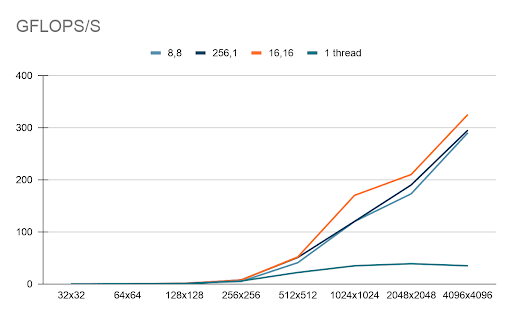
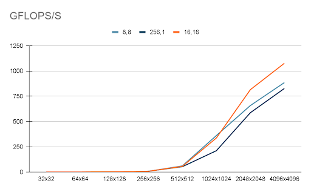
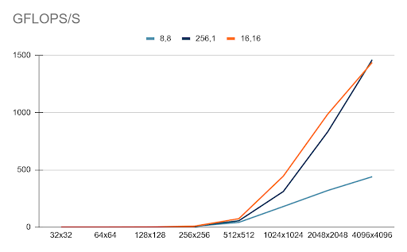
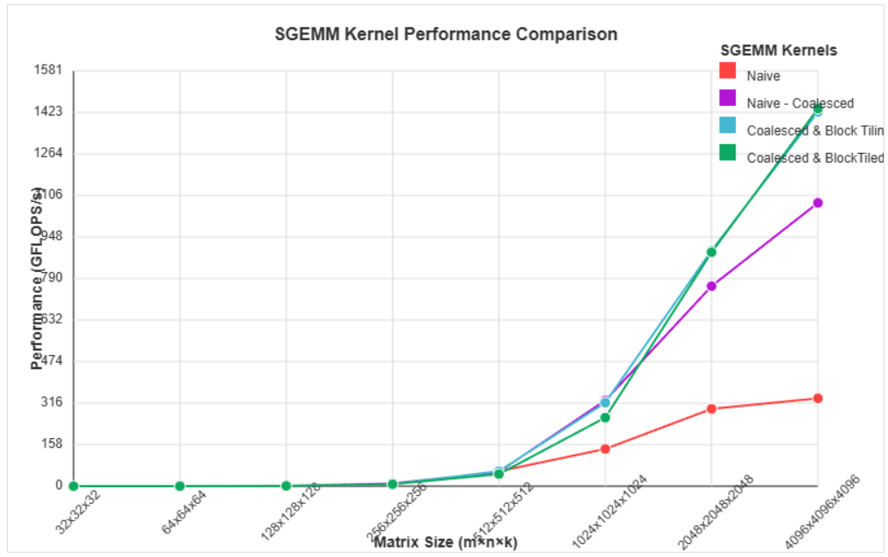

# Fast WebGPU SGEMM

In this project, we seek to use WebGPU's Compute shaders to write a fast single-precision General Matrix Multiplication (SGEMM) kernel. To these ends, we develop a series of iteratively better kernels, analyze their performance, and understand their limitations. We also developed a handy benchmarking tool on the web to allow anyone to benchmark our results on their hardware. Our results were collected on a Windows PC running chrome on an RTX 5060ti GPU.

We start from a naive kernel and iteratively apply four optimizations:
1) more threads / better workgroup shapes  
2) coalesced global memory access  
3) block tiling using workgroup (“shared”) memory  
4) vectorized loads via `vec4<f32>`  

The goal: close the gap between portable WebGPU kernels and heavily tuned vendor libraries.

---

## Problem

Given `A ∈ R^(M×K)`, `B ∈ R^(K×N)`, compute:

`C = α · A · B + β · C`

For square matrices (`M=N=K=n`), the compute cost is approximately:

`FLOPs ≈ 2n^3`

---

## Baseline (Naive Kernel)

**One thread computes one output element `C[i,j]`** and performs the full dot-product over `k`.

Why it’s slow:
- Massive redundant global memory loads
- No reuse of `A`/`B` values across nearby threads
- Poor memory behavior dominates

---

## Optimization 1 — More Threads + 2D Workgroups

Instead of `workgroup_size(1,1,1)`, we increase parallelism (e.g. `8×8`, `16×16`, `256×1`).

Why it helps:
- More active threads improves **occupancy** and **latency hiding**
- 2D workgroups often map more naturally onto the 2D output tile



---

## Optimization 2 — Coalesced Global Memory Access

We adjust indexing so **adjacent threads access adjacent memory addresses**, reducing strided access patterns.

Why it helps:
- GPUs combine neighboring loads into fewer memory transactions (coalescing)
- Fewer transactions → higher effective bandwidth → less time stalled on memory



---

## Optimization 3 — Block Tiling with Workgroup Memory (Shared Memory)

We load tiles of `A` and `B` into `var<workgroup>` memory, then reuse them across many multiply-accumulate operations.

Why it helps (biggest win):
- Dramatically reduces global memory traffic
- Increases arithmetic intensity by reusing loaded data
- Synchronization via barriers ensures correctness between load/compute phases



---

## Optimization 4 — Vectorized Access (`vec4<f32>` Packing)

We pack 4 floats into `vec4<f32>` expecting better throughput from wider loads and potential SIMD/vector ALU utilization.

What happened:
- **No major performance gain observed** in WebGPU (in our tests)

Why it might not help here:
- Benefits depend on compiler/backend generating real vectorized memory ops
- Without visibility into compiled GPU ISA, we can’t confirm the intended vectorization occurred
- Memory + synchronization costs may dominate anyway

---

## Results

Across the iterative improvements, peak performance reached **~1480 GFLOP/s** in our best kernel configuration (on an RTX 5060 Ti test system), roughly a **~5× speedup** over earlier working variants and about **~7% of theoretical FP32 peak** (device-dependent).



---

## Key Takeaways

- **More threads / smarter workgroups** help, but only up to the point where memory becomes the bottleneck.
- **Coalescing matters a lot** — you can lose huge performance with “correct but strided” access.
- **Block tiling is the main unlock** — reuse is everything in GEMM.
- **`vec4` packing isn’t guaranteed to help** in WebGPU due to backend/compiler uncertainty.

---

## Limitations

- Accurate GPU timing in WebGPU is tricky without timestamp queries.
- Browser profiling tools are limited (largely for security reasons).
- Portable shaders can’t match vendor-tuned kernels that exploit architecture-specific scheduling and microkernels.

---

## Future Work
a few ideas to I'd like to pursue:
- **Register tiling**: each thread computes multiple `C` outputs to increase reuse
- **Systematic parameter sweeps**: tune `(BM, BN, BK)` and per-thread work
- **Reduce barrier overhead**: double-buffer tiles / prefetch next tile while computing current

---


> [!Note]
> how to run:

```bash
npm install
npm i
npm run dev
```
